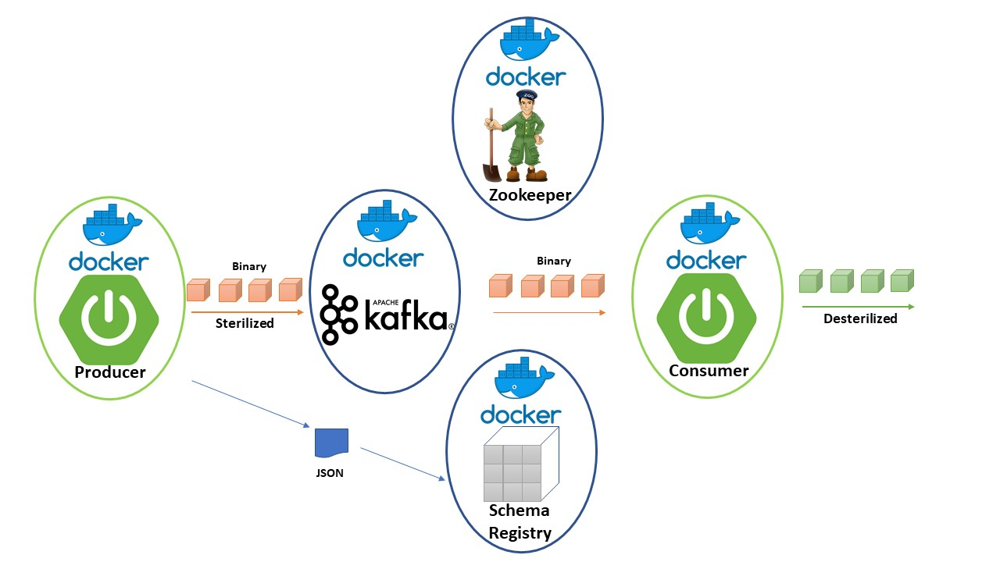
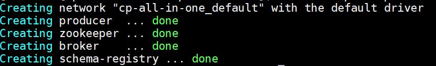
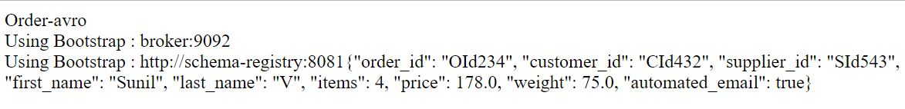
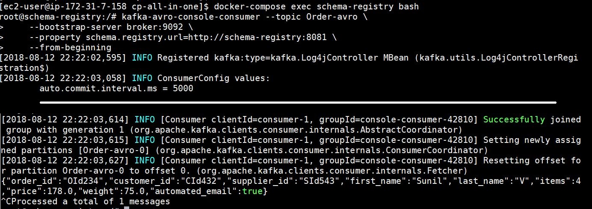

# Spring Boot + Kafka + Schema Registry - Tutorial

## What is Schema Registry?

According to [Confluent.io](https://docs.confluent.io/current/schema-registry/docs/index.html) : The Schema Registry stores a versioned history of all schemas and allows for the evolution of schemas according to the configured compatibility settings and expanded Avro support.

## Why do we need a Schema Registry?

Simply put, we want to avoid garbage-in-garbage-out scenarios. Schema Registry enables message producers to comply to a JSON schema and avoid producers from pushing message that are bad in to topics. This saves a lot of headache for down-stream consumer. Schema Registry is a critical component in enforcing data governance in a messaging platform. 

## What is Avro?

According to [Avro.Apache.org](https://avro.apache.org/docs/current/) : Apache Avro™ is a data serialization system.

Avro provides:

 - Rich data structures.
 - A compact, fast, binary data format.
 - A container file, to store persistent data.
 - Remote procedure call (RPC).
 - Simple integration with dynamic languages. Code generation is not required to read or write data files nor to use or implement RPC protocols. Code generation as an optional optimization, only worth implementing for statically typed languages.

 ## What will we build in this tutorial

This is a tutorial for creating a simple Spring Boot application with Kafka and Schema Registry.
The following topics are covered in this tutorial:
1. Working with Confluent.io components
2. Creating a Kafka Avro Producer using Spring Boot
3. Creating Avro schema and generating Java classes  
4. A REST interface to send messages to a Kafka topic with Avro schema
5. View the messages from a Kafka Avro Consumer

## Getting Started

In our sample application we will build a Spring Boot microservice that produces messages and uses Avro to serialize and push them into Kafka.
For this tutorial we will be using the open source components of confluent platform. All of our microservices and infrastructure components will be dockerized and run using docker-compose.  


### Get the code and tools

-Download and install Maven from https://maven.apache.org/download.cgi

-Download and install JDK 1.8 from http://www.oracle.com/technetwork/java/javase/downloads/index.html

-Download and install Docker and Docker Compose for your OS.

Clone this repo to your machine and change directory to spring-kafka-registry. Build the docker image referenced in the compose file

```
git clone https://github.com/sunilvb/spring-kafka-registry.git

cd spring-kafka-registry
```
First things first. 

Let's open the pom.xml file and look at the maven dependencies that are particularly important in this sample.

The two important sections that help in making the magic happen are the Spring Kafka related dependencies and the Avro related dependencies as shown below :
```
<!-- spring-kafka dependencies -->
<dependency>
	<groupId>org.springframework.kafka</groupId>
	<artifactId>spring-kafka</artifactId>
	<version>${spring-kafka.version}</version>
</dependency>
<dependency>
	<groupId>org.springframework.kafka</groupId>
	<artifactId>spring-kafka-test</artifactId>
	<version>${spring-kafka.version}</version>
	<scope>test</scope>
</dependency> 
```
And ...

```
<!-- avro dependencies -->
<dependency>
	<groupId>org.apache.avro</groupId>
	<artifactId>avro</artifactId>
	<version>${avro.version}</version>
</dependency>
<dependency>
	<groupId>io.confluent</groupId>
	<artifactId>kafka-avro-serializer</artifactId>
	<version>${confluent.version}</version>
</dependency>
```
We will revisit these components later but first let's look at the Avro schema file in the source code. 

Open the order.avsc file from src\main\resources\avro

```
{
     "type": "record",
     "namespace": "com.sunilvb.demo",
     "name": "Order",
     "version": "1",
     "fields": [
       { "name": "order_id", "type": "string", "doc": "Id of the order filed" },
       { "name": "customer_id", "type": "string", "doc": "Id of the customer" },
       { "name": "supplier_id", "type": "string", "doc": "Id of the supplier" },
       { "name": "first_name", "type": "string", "doc": "First Name of Customer" },
       { "name": "last_name", "type": "string", "doc": "Last Name of Customer" },
       { "name": "items", "type": "int", "doc": "Totla number of items in the order" },
       { "name": "price", "type": "float", "doc": "Total price of the order" },
       { "name": "weight", "type": "float", "doc": "Weight of the items" },
       { "name": "automated_email", "type": "boolean", "default": true, "doc": "Field indicating if the user is enrolled in marketing emails" }
     ]
}
```
This is a simple Avro Schema file that describes the Order message structure with various data types.

Following are the two types of data types supported in Avro:

Primitive type: Primitive type are used to define the data types of fields in our message schema. All premetive types are supported in Avro. In our Order example, we are using string, int, float in the Avro message schema.

Complex type: We could also use these six complex data types supported in Avro to define our schema: records, enums, arrays, maps, unions and fixed. In our Order example, we are using the 'record' complex type to define order message.

### Generate classes from Avro schema files

Once we define the schema, we then generate the Java source code using the maven plugin.

Let's look at the pom.xml file once again 

```
<plugin>
	<groupId>org.apache.avro</groupId>
	<artifactId>avro-maven-plugin</artifactId>
	<version>${avro.version}</version>
	<executions>
		<execution>
			<phase>generate-sources</phase>
			<goals>
				<goal>schema</goal>
			</goals>
			<configuration>
				<sourceDirectory>${project.basedir}/src/main/resources/avro/</sourceDirectory>
				<outputDirectory>${project.build.directory}/generated/avro</outputDirectory>
			</configuration>
		</execution>
	</executions>
</plugin>
			
```
Notice the sourceDirectory and outputDirectory locations defiled in the configuration section of the avro-maven-plugin

The following command in maven lifecycle phase will do the trick and put the generated classes in our outputDirectory: 

spring-kafka-registry\target\generated\avro\

```
mvn generate-sources
```

The generated source code comes in very handy to process messages in our application.

###Spring Boot Application

Now let's see how this is done.
Open the main application class defined in the source file SpringKafkaRegistryApplication.java from following location:

spring-kafka-registry\src\main\java\com\sunilvb\demo

Notice that we properties that are defined to ensure we are able to interact with the Kafka and Schema Registry instances  
```
...
Properties properties = new Properties();
// Kafka Properties
properties.setProperty("bootstrap.servers", bootstrap);
properties.setProperty("acks", "all");
properties.setProperty("retries", "10");
// Avro properties
properties.setProperty("key.serializer", StringSerializer.class.getName());
properties.setProperty("value.serializer", KafkaAvroSerializer.class.getName());
properties.setProperty("schema.registry.url", registry);
...
```
In addition to the bootstrap server and the schema registry url, we are also setting the serializer classes for key and value properties.

The KafkaAvroSerializer class is responsible for serializing the message in to Avro format. 

After setting all the needed properties we then create an instance of the KafkaProducer. 

We then build the Order object using the generated class and send it off to the Kafka topic.

The setter methods in the generated Order class come in very handy. 
```
...
Producer<String, Order> producer = new KafkaProducer<String, Order>(properties);

Order order = Order.newBuilder()
		.setOrderId("OId234")
		.setCustomerId("CId432")
		.setSupplierId("SId543")
		.setItems(4)
		.setFirstName("Sunil")
		.setLastName("V")
		.setPrice(178f)
		.setWeight(75f)
		.build();

ProducerRecord<String, Order> producerRecord = new ProducerRecord<String, Order>(topic, order);


producer.send(producerRecord, new Callback() {
	@Override
	public void onCompletion(RecordMetadata metadata, Exception exception) {
		if (exception == null) {
			logger.info(metadata); 
		} else {
			logger.error(exception.getMessage());
		}
	}
});

producer.flush();
producer.close();
...
``` 
		

### Package the Spring Boot jar and create the docker image

To compile and package the jar file and create a docker image, run the following commands shown below:

```
mvn package

mv target/*.jar app.jar
 
docker build -t spring-kafka-registry .
```


### Running all the docker containers together

To run the sample make sure you have installed Docker and Docker Compose for your OS. 

And simply run this command in the source root


```
docker-compose up -d
```
you should see all the containers come up as shown below:



And point your browser to 

```
http://localhost:8888/oreder?name=<name of your kafka topic>
```
or use curl to access the url as shown below :

```
curl localhost:8888/oreder?name=<name of your kafka topic>
```

This will produce the Order message and serialize it into Avro format and pushed in to the Kafka topic as a binary message.

You should see the following output in your browser window or the terminal if you user curl to confirm the message was poseted to Kafka topic: 



### Checking the message in Kafka Avro Consumer

To consume the mesasges and Deserialise the binary message back into a proper Order object we can run the built in command line utility.

Run the following commands :


```
docker-compose exec schema-registry bash
```
This will put you into the Schema Registry conatainer where you can execute the command line Avro consumer to see your message. 

Make sure you pass the same topic name that you used in the Kafka Avro Producer above.

```
kafka-avro-console-consumer --topic <name of your kafka topic> \
    --bootstrap-server broker:9092 \
    --property schema.registry.url=http://schema-registry:8081 \
    --from-beginning
```
You should see a similar output in your browser window (edited for brevity):

 

That concludes our sample application.

### Bring down the application and containers
```
docker-compose down
```
Stops containers and removes containers, networks, volumes, and images created by up.

By default, the only things removed are:

Containers for services defined in the Compose file
Networks defined in the networks section of the Compose file
The default network, if one is used

You should see something similar to the output below : 

 


## Built With

* [Spring Boot](https://projects.spring.io/spring-boot/) - The Web Framework for Java based Microservices
* [Apache Kafka](https://maven.apache.org/) - Message Broker and Streaming Platform
* [Confluent Schema Registry](https://maven.apache.org/) - Schema Registry Module
* [Maven](https://maven.apache.org/) - Dependency Management
* [Docker and Docker Compose](https://www.docker.com/) - Containerization

## Contributing

Please read [CONTRIBUTING.md](CONTRIBUTING.md) for details on our code of conduct, and the process for submitting pull requests to us.

## Versioning

We use [TBD](http://tbd.org/) for versioning. For the versions available, see the [tags on this repository](https://github.com/your/project/tags). 

## Authors

* **Sunil Vishnubhotla** - *Initial work* - [sunilvb](https://github.com/sunilvb)

See also the list of [contributors](https://github.com/your/project/contributors) who participated in this project.

## License

This project is licensed under the MIT License - see the [LICENSE.md](LICENSE.md) file for details

## Acknowledgments

* Hat tip to anyone who's code was used
* Inspiration from open source contributors
* All open source and commertial components used in this sample are maintained and produced by respective organization
